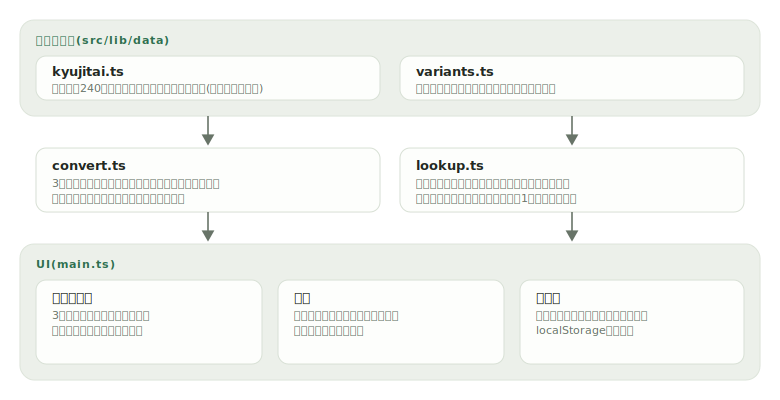

# itaiji

[](https://github.com/miruky/itaiji/actions/workflows/ci.yml)
[](https://github.com/miruky/itaiji/actions/workflows/deploy.yml)
[](https://www.typescriptlang.org/)
[](LICENSE)

**旧字体・新字体・人名異体字をブラウザ内で相互変換する字体ツール。240組の新旧対応表と、どの字からでも引ける字典つき**

デモ: https://miruky.github.io/itaiji/

## 概要

itaijiは、漢字の字体を変換するWebアプリである。モードは3つあり、「旧字体から新字体へ」は戦前の文書や古い戸籍の写しを現代の字体に揃える。「新字体から旧字体へ」は題字や作品で康熙字典体の表記を作る。「異体字を通用字体へ」は髙(はしごだか)・﨑(たつさき)・𠮷(つちよし)のような人名異体字を通用字体に写し、名簿の表記確認などに使う。

変換された字はハイライトされ、元の字がツールチップで見える。クリックすると字典が開き、その字が属するグループ(例: 弁・辨・瓣・辯)と注記を確認できる。字典は検索もでき、新字体・旧字体のどちらから引いても同じグループに到達する。

対応表は性質の異なる2系統に分けてある。新旧字体は一対一の組だけを双方向変換に使い、「弁」のように旧字体が複数ある字(辨・瓣・辯)は旧→新の一方向だけに使う。新→旧では文脈なしに正しい旧字体を選べないため、誤変換するくらいなら変換しない。

### なぜ作ったのか

古い文献を引用するとき、旧字体を一文字ずつIMEで探して入力し直すのは骨が折れる。逆に、祖父母の世代の文書を現代の表記に直す用途も多い。既存の変換サービスは対応表の中身が見えず、なぜその字に変換されたのか確かめられないものが多い。本ツールは対応表そのものを字典として公開し、変換結果のどの字からでも根拠のグループへ飛べるようにした。

## アーキテクチャ



## 技術スタック

| カテゴリ             | 技術                                 |
| :------------------- | :----------------------------------- |
| 言語                 | TypeScript 5(strict、実行時依存ゼロ) |
| ビルド               | Vite 6                               |
| テスト               | Vitest(node環境)                     |
| リンタ・フォーマッタ | ESLint(typescript-eslint)+ Prettier  |
| CI / 配信            | GitHub Actions / GitHub Pages        |

## 使い方

### 変換する

```ts
import { toKyujitai, toShinjitai, normalizeVariants } from './src/lib';

toShinjitai('國家の發展と藝術の價値を論ずる學者');
// => '国家の発展と芸術の価値を論ずる学者'

toKyujitai('国家の経済と芸術');
// => '國家の經濟と藝術'

normalizeVariants('髙橋さんと山﨑さんと𠮷田さん');
// => '高橋さんと山崎さんと吉田さん'
```

### 変わった箇所を受け取る

```ts
import { convert } from './src/lib';

const r = convert('旧学校', 'to-kyujitai');
// r.text     => '舊學校'
// r.segments => [
//   { text: '舊', from: '旧' },
//   { text: '學', from: '学' },
//   { text: '校' },
// ]
// r.changed  => 2
```

走査はコードポイント単位なので、基本多言語面の外にある「𠮷」(U+20BB7)も壊れない。

### 字典を引く

```ts
import { lookupChar } from './src/lib';

lookupChar('辯');
// => { char: '辯', group: ['弁', '辨', '瓣', '辯'], kind: 'kyujitai' }

lookupChar('髙');
// => { char: '髙', group: ['高', '髙'], kind: 'variant', note: 'いわゆる「はしごだか」。...' }
```

## プロジェクト構成

- `src/lib/data/kyujitai.ts` 新旧字体240組と、旧字体側だけの一方向対応
- `src/lib/data/variants.ts` 人名異体字グループと注記
- `src/lib/convert.ts` 3方向の写像とコードポイント単位の置換
- `src/lib/lookup.ts` どの字からでも引ける字典の索引
- `src/main.ts` 変換ビュー・字典・入出力のUI
- `docs/` アーキテクチャ図

## はじめ方

### 前提条件

- Node.js 22以上

### セットアップ

```bash
git clone https://github.com/miruky/itaiji.git
cd itaiji
npm ci
npm run dev
```

### テスト・lint・ビルド

```bash
npm test
npm run lint
npm run build
```

テストには対応表全組の往復(新→旧→新)検査と、データの整合性検査(重複・文字数・グループの排他)を含む。

### デプロイ

mainへのpushで `deploy.yml` がGitHub Pagesへ公開する。サブパス配信のためのbaseは環境変数 `ITAIJI_BASE` で渡す。

## 制約

- 変換は1文字単位で、語の文脈を見ない。「芸」のように新旧で別字が衝突する字(藝の新字体と、うんと読む本来の芸)は区別できず、一律に表へ従う。
- 収録は常用漢字の新旧対応を中心とした240組と人名異体字11グループで、人名用漢字や拡張漢字の異体すべては網羅しない。
- 旧字体が複数ある字(弁など)は新→旧方向では変換しない。意味で選ぶ必要があるため、機械的な置換では正しくならない。
- 固有名詞の字体は本人の表記が正である。「異体字を通用字体へ」は表記の確認用であり、勝手な書き換えを推奨するものではない(UIにも明記)。

## 設計方針

- **誤変換するくらいなら変換しない** — 一対一で確実な組だけを双方向に使い、多対一の組は安全な方向にだけ使う。曖昧さをデータ構造(PAIRSとKYU_TO_SHIN_ONLYの分離)で表現する。
- **対応表は見える形で持つ** — 変換器の中身は2つのデータファイルがすべてで、字典UIから全グループを閲覧できる。データの整合性(重複なし・1文字・グループ排他)はテストで保証する。
- **コードポイント単位で壊さない** — サロゲートペアを含む字(𠮷)を文字列インデックスで割らない。走査・字数の数え方を統一する。
- **根拠に飛べる** — 変換結果のハイライトから、その字のグループと注記へ1クリックで到達できる。

## ライセンス

[MIT](LICENSE)
